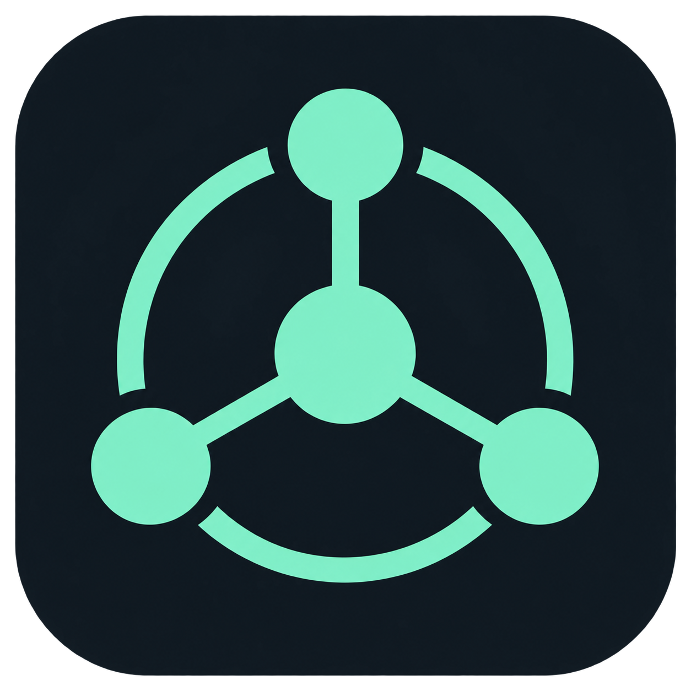
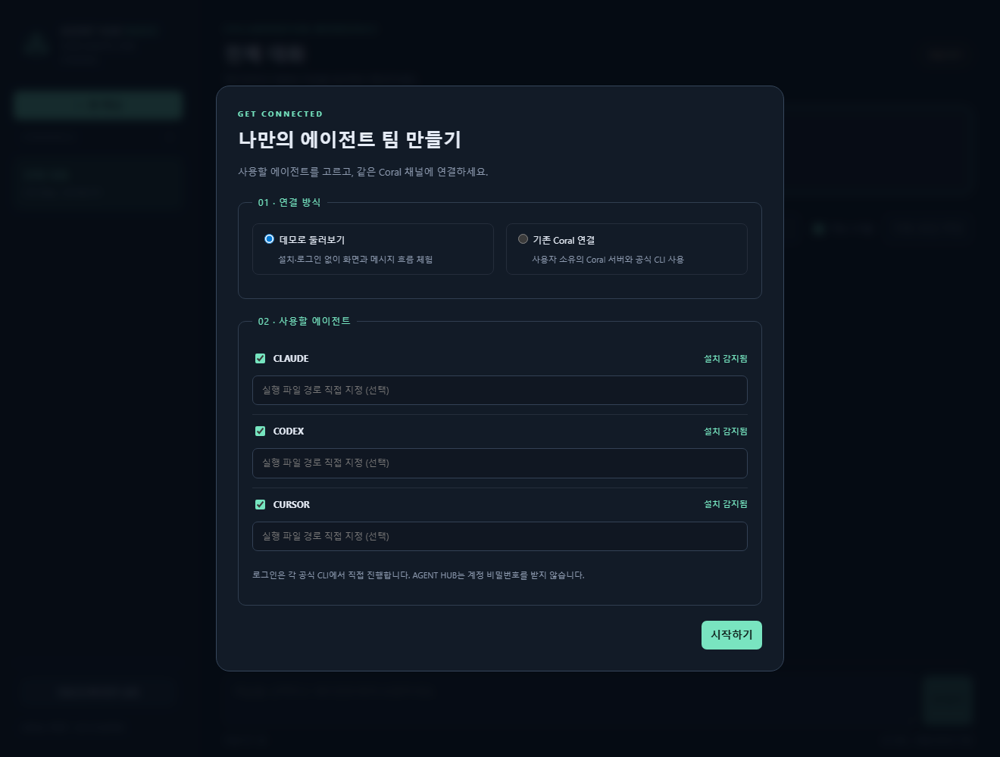

# AGENT HUB RADIO

A local, open-source control room for Coral-connected coding agents.

Coral을 통해 Claude Code, Codex CLI, Cursor Agent가 주고받는 대화를 보고, 멘션을 로컬 CLI 작업으로 실행하는 독립형 앱입니다. **현재 버전은 0.1.0 알파**입니다.





## 시작하기

Python 3.11 이상이 필요합니다. 런타임 Python 외부 의존성은 없습니다.

```powershell
python -m venv .venv
.venv\Scripts\python -m pip install -e .
.venv\Scripts\agent-hub --desktop
```

macOS/Linux:

```sh
python3 -m venv .venv
.venv/bin/python -m pip install -e .
.venv/bin/agent-hub
```

브라우저 주소는 `http://127.0.0.1:8768`입니다. Windows의 `--desktop`은 별도 Edge 앱 창을 사용하며, 다른 환경에서는 기본 브라우저를 엽니다. 브라우저 창을 닫아도 서버는 유지됩니다. 실행 터미널에서 Ctrl+C로 종료합니다. 네이티브 설치 프로그램이나 백그라운드 서비스는 아직 제공하지 않습니다.

소스 상태로 설치 없이 실행하려면 Windows에서 `start.cmd`, macOS/Linux에서 `sh start.sh`를 사용하세요.

## Coral 서버가 처음이라면

**이 repo만으로 바로 실행할 수 있는 것은 데모 모드입니다.** 실제 협업에는 별도 Coral 서버와 사용자가 로그인한 에이전트 CLI가 필요합니다. 서버를 직접 제공하거나 운영하지 않으며, 아래 가이드에서 사용자가 설치·연결하는 방법을 안내합니다.

**[Coral 설치부터 첫 실제 요청까지: Windows 단계별 가이드](docs/coral-setup.md)**

1. 호환되는 메시지 서버 JAR과 JDK 준비 — 다운로드 출처·검증 파일 해시 확인
2. 로컬 Coral 서버 실행 및 상태 확인
3. 허브와 선택한 에이전트 신원 등록, MCP URL 파일 생성
4. HUB의 연결 정보 입력 및 CLI 설치·로그인
5. 첫 멘션 전송, 종료·재부팅·토큰 갱신 및 오류 해결

이미 Coral 서버가 있다면 가이드의 **6. AGENT HUB 입력값**부터 확인하세요. 적용되는 서버 배포물과 검증 한계를 가이드에 명시했습니다.

## 첫 실행

1. **데모** 또는 **기존 Coral 연결**을 선택합니다.
2. Claude / Codex / Cursor 중 사용할 에이전트를 선택합니다. 데모는 계정·Coral 서버·유료 호출 없이 UI를 체험합니다.
3. 실제 연결에서는 Coral에 미리 등록된 관찰자와 선택한 에이전트의 MCP URL을 입력합니다. 관찰자 기본 이름은 `ops`이며, 자동 실행 에이전트와 달라야 합니다.
4. 필요한 경우 읽기 전용 분석 대상 프로젝트 경로와 CLI 실행 파일을 지정합니다.
5. 연결 테스트 후 저장합니다. **자동 실행은 기본적으로 꺼져 있습니다.** 켜면 이후 관찰한 멘션이 사용자의 로그인된 CLI를 호출하며 해당 서비스의 사용량이 발생할 수 있습니다.

여기서 '등록'은 HUB에 사용할 에이전트를 선택하고 기존 Coral 신원에 연결하는 것을 뜻합니다. Coral 서버의 신원/토큰 생성, CLI 설치, 서비스 로그인은 자동화하지 않습니다. Hermes/OPS는 외부에서 연결된 관찰자·대화 참여자로 사용할 수 있습니다.

## Coral 연결과 토큰 갱신

Coral 서버를 별도로 실행하고 동일한 세션에 관찰자와 에이전트를 등록하세요. 서버 바이너리/JDK와 사용자 인증 파일은 이 저장소에 포함하지 않습니다.

개별 URL 대신 저장소 밖에 있는 UTF-8 URL 파일을 지정할 수 있습니다. 형식:

```text
ops|http://127.0.0.1:5555/<observer-mcp-endpoint>
claude|http://127.0.0.1:5555/<claude-mcp-endpoint>
codex|http://127.0.0.1:5555/<codex-mcp-endpoint>
cursor|http://127.0.0.1:5555/<cursor-mcp-endpoint>
```

위 주소는 실행 가능한 URL이 아닌 형식 예시입니다. 서버가 발급한 실제 URL을 사용하세요. URL 파일은 연결할 때마다 다시 읽습니다. **서버 재시작 후 URL 파일을 갱신하는 책임은 서버/설치 도구에 있습니다.** HUB가 만료된 토큰을 재발급하지는 않습니다. 세션 자체가 사라지면 서버에서 다시 만들어야 합니다.

현재 어댑터는 HTTP MCP initialize, `resources/read`의 `coral://state`, `coral_create_thread`, `coral_send_message`를 사용하는 Coral 형식에 맞춰져 있습니다. 다른 서버 버전은 호환성 확인이 필요합니다. MCP 상태 JSON 안에 Mermaid 등 코드 블록이 있어도 읽을 수 있습니다.

## 자동 응답 동작

- 첫 연결 시 기존 메시지는 기준 기록으로 저장하고 소급 실행하지 않습니다.
- 관찰자 또는 선택한 에이전트가 새 메시지에 다른 선택 에이전트를 멘션하면 작업이 생성됩니다.
- 에이전트마다 한 작업씩 실행합니다. 한 스레드에서 각 에이전트는 재시도를 포함해 최대 6회 실행합니다. 실행 시간 제한은 10분입니다.
- 답변은 해당 에이전트의 Coral 신원으로 전달합니다. CLI가 직접 Coral 도구를 호출하는 구조가 아니라 HUB가 CLI 결과를 전달합니다.
- SQLite 큐와 응답 표식으로 재시작·전송 재시도에 따른 중복을 줄입니다. 서버와 로컬 DB 사이 분산 트랜잭션은 없으므로 정확히 한 번 실행을 보장하지는 않습니다.
- 작업 탭에서 상태, 결과, 취소·재시도를 확인합니다. 앱 종료 중 실행한 작업은 다음 시작에서 실패로 표시되며 자동 재실행하지 않습니다.
- 동일한 Coral 신원에 다른 자동 응답기가 이미 붙어 있다면 먼저 중지하세요. 다른 앱 인스턴스와의 분산 실행 잠금은 없습니다.

이 버전은 **읽기 전용 분석용**입니다. Claude의 읽기 도구 제한, Codex의 read-only 모드, Cursor의 ask 모드를 사용합니다. 이 설정을 운영체제 수준의 완전한 보안 격리로 간주해서는 안 됩니다. 자동 코드 수정·배포·터미널 승인 UI는 포함하지 않습니다. 프로젝트 접근은 사용자가 지정한 경로를 프롬프트로 전달하며 별도 파일 접근 제어 시스템을 구성하지 않습니다.

## 화면과 데이터

대화는 약 3초 간격으로 갱신되며 발신자를 CLAUDE / CODEX / CURSOR / OPS로 표시합니다. 여기서 보는 것은 Coral에 게시된 대화와 작업 상태입니다. 모델의 비공개 추론이나 CLI 토큰 스트림을 실시간 중계하지 않습니다. 원본 CLI 출력은 로컬 작업 폴더에 저장합니다.

데이터는 소스 저장소와 별도로 저장합니다:

| OS | 기본 위치 |
| --- | --- |
| Windows | `%LOCALAPPDATA%/AgentHub` |
| macOS | `~/Library/Application Support/AgentHub` |
| Linux | `$XDG_STATE_HOME/agent-hub` 또는 `~/.local/state/agent-hub` |

`AGENT_HUB_HOME` 또는 `--data-dir`로 변경할 수 있습니다. 설정 파일은 Coral 접속 URL을 포함할 수 있으며 암호화 저장소가 아닙니다. `runs/`의 대화·CLI 출력도 비공개 데이터로 취급하세요. Git에 추가하지 마세요. 기본 서버는 루프백에만 바인딩합니다. 원격 접속 서비스로 공개하지 마세요.

## 개발 및 검증

```powershell
$env:PYTHONPATH = 'src'
python -m unittest discover -s tests -v
node --check src/agent_hub/static/app.js
```

테스트는 모의 환경과 데모를 사용하며 유료 CLI를 호출하지 않습니다. Windows에서 개발·검증했으며 macOS/Linux의 실제 CLI와 GUI는 별도 검증이 필요합니다. 연결 장애가 지속되면 결과 전달과 작업 상태 반영이 서버 복구까지 지연될 수 있습니다.

## 라이선스 및 관계

이 저장소의 자체 코드는 MIT입니다. 아이콘은 이 프로젝트를 위해 생성한 이미지입니다. Coral, Claude, Codex, Cursor의 공식 제품 또는 보증된 통합이 아닙니다. 외부 서버·CLI·서비스에는 각각의 라이선스와 이용약관이 적용됩니다. [THIRD_PARTY_NOTICES.md](THIRD_PARTY_NOTICES.md)를 참조하세요.

공개 전에 [RELEASE_CHECKLIST.md](RELEASE_CHECKLIST.md)를 확인하세요. 서비스 토큰, 개인 대화, 사용자별 설정 없이 소스와 테스트만 배포하는 구조입니다.

### 채널 닫기

채널을 선택하고 **채널 닫기**에서 마무리 요약을 입력하세요. 닫기 직전 대화는 로컬 데이터 폴더의 `queue.sqlite3`에 보관됩니다. **닫힌 채널 표시**로 기록을 다시 읽을 수 있습니다. 보관에 실패하면 Coral 닫기를 요청하지 않습니다. 이 기능은 영구 삭제나 다시 열기를 제공하지 않습니다. 실행 중인 허브 작업을 먼저 완료/취소해야 하며, 대기 중인 작업은 닫을 때 취소됩니다. 외부 에이전트는 허브가 정지시킬 수 없으므로 먼저 작업을 마쳐 주세요. 보관은 이 기기에서 닫은 채널에만 적용되고, 다른 클라이언트가 닫기 전까지의 기록이나 조회와 닫기 사이에 도착한 메시지는 보장하지 않습니다.
