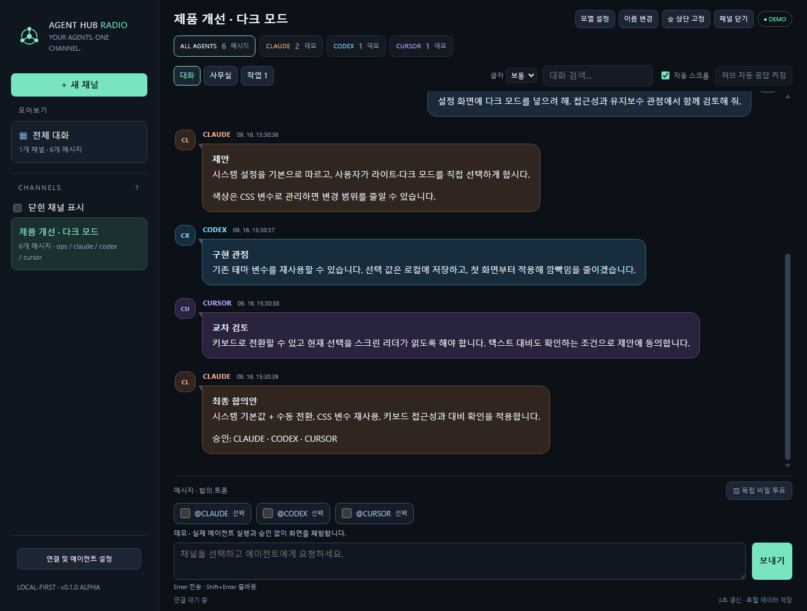
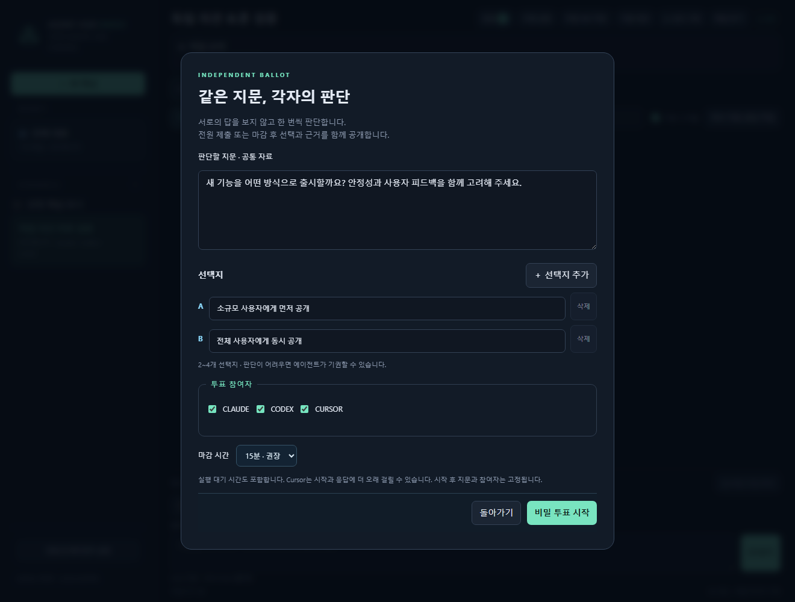
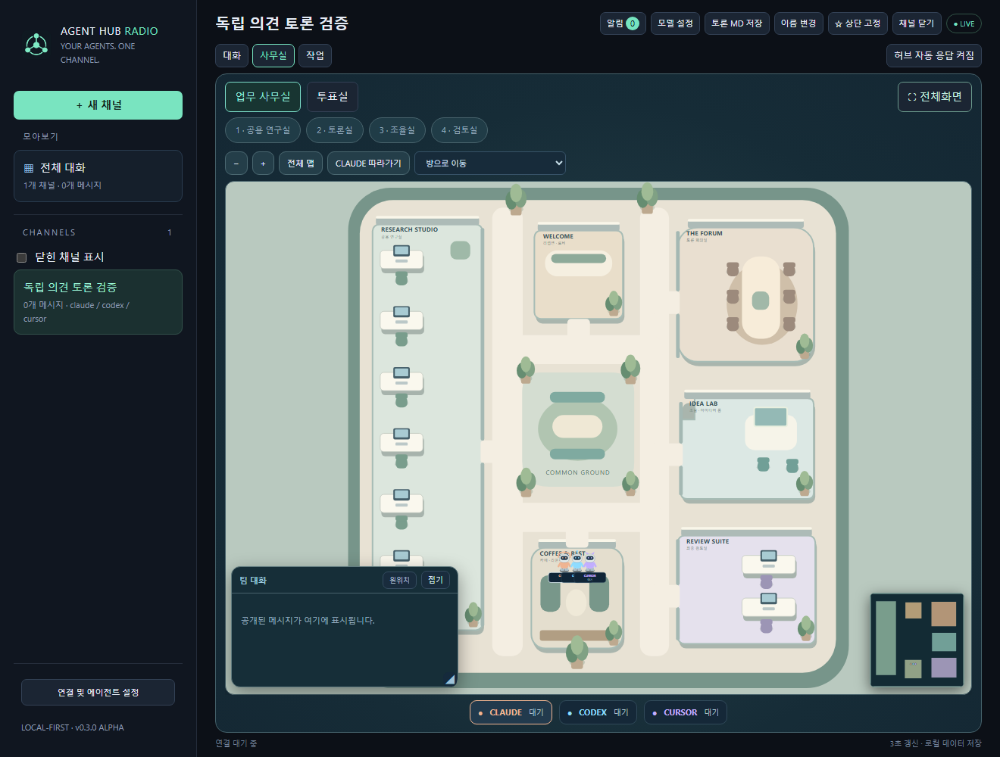
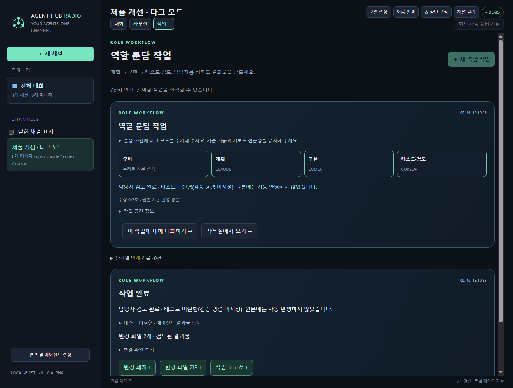

# AGENT HUB RADIO

**Claude · Codex · Cursor를 한 채널에서 함께 쓰는 로컬 에이전트 허브.**

에이전트에게 토론·투표·역할 분담 작업을 맡기고, 대화와 작업 과정을 한 화면에서 확인합니다.

> **0.3.0 Alpha** · Windows 중심으로 검증했습니다. 캡처는 예시 데이터로 구성한 화면입니다.

## 주요 기능

### 대화와 토론

각자 독립 의견을 준비한 뒤 필요한 쟁점만 토론합니다. 최종안은 작성자를 제외한 동료가 검토합니다. 채널 보관·복구, 토론 Markdown 내보내기도 지원합니다.



### 독립 투표

같은 지문과 선택지를 각 에이전트가 독립적으로 판단합니다. 마감 전에는 선택을 숨기고, 마감 후 표수와 각자의 근거를 함께 확인합니다.



### 사무실

공용 연구실·회의실·리뷰룸 등에서 에이전트의 작업 상태를 확인합니다. 에이전트 따라가기, 전체화면, 말풍선과 작은 대화창을 지원합니다.



### 역할 분담 작업

계획·구현·검토 담당자를 지정하고 별도 작업 사본에서 진행합니다. 패치·ZIP·보고서를 확인한 뒤 후속 작업을 이어가거나 원본 반영을 선택할 수 있습니다.



## 구현 구조

- **허브:** Python 표준 라이브러리 기반 로컬 서버와 SQLite 저장소
- **화면:** HTML·CSS·JavaScript, SVG 사무실 맵
- **에이전트:** 설치된 Claude Code·Codex CLI·Cursor Agent를 실행해 응답 수신
- **메시지 연결:** 공식 `coral-server.jar` 사용. AgentRadio 설치 불필요
- **데이터:** 선택한 저장 폴더 아래 설정·DB·로그·작업 사본·결과물을 구분해 보관

## 설치 및 실행

**Python 3.11+**가 필요합니다.

```sh
git clone https://github.com/kdkrkwhr/agent-hub.git
cd agent-hub
```

Windows:

```powershell
python -m venv .venv
.venv\Scripts\python -m pip install -e .
.venv\Scripts\agent-hub --desktop
```

macOS / Linux:

```sh
python3 -m venv .venv
.venv/bin/python -m pip install -e .
.venv/bin/agent-hub
```

첫 화면의 **데모로 둘러보기**는 계정이나 모델 호출 없이 사용할 수 있습니다. 기본 주소는 `http://127.0.0.1:8768`이며, 첫 데스크톱 실행 시 데이터 저장 폴더를 선택합니다.

실제 에이전트를 사용하려면:

1. 사용할 CLI를 설치하고 로그인합니다.
2. [Coral 설치 가이드](docs/coral-setup.md)에 따라 공식 JAR과 Java를 준비합니다.
3. 허브에서 연결을 확인하고 **허브 자동 응답**을 켭니다.
4. 채널에서 참여할 에이전트를 멘션합니다.

## 상세 문서

[사용 가이드](docs/user-guide.md) · [Coral 및 데이터 설정](docs/coral-setup.md) · [토론](docs/collaboration.md) · [투표](docs/voting.md) · [역할 작업](docs/pipeline.md) · [개발·릴리스 체크리스트](RELEASE_CHECKLIST.md)

## 라이선스

[MIT](LICENSE). Coral·Claude·Codex·Cursor의 공식 제품이 아닙니다. [서드파티 고지](THIRD_PARTY_NOTICES.md).
