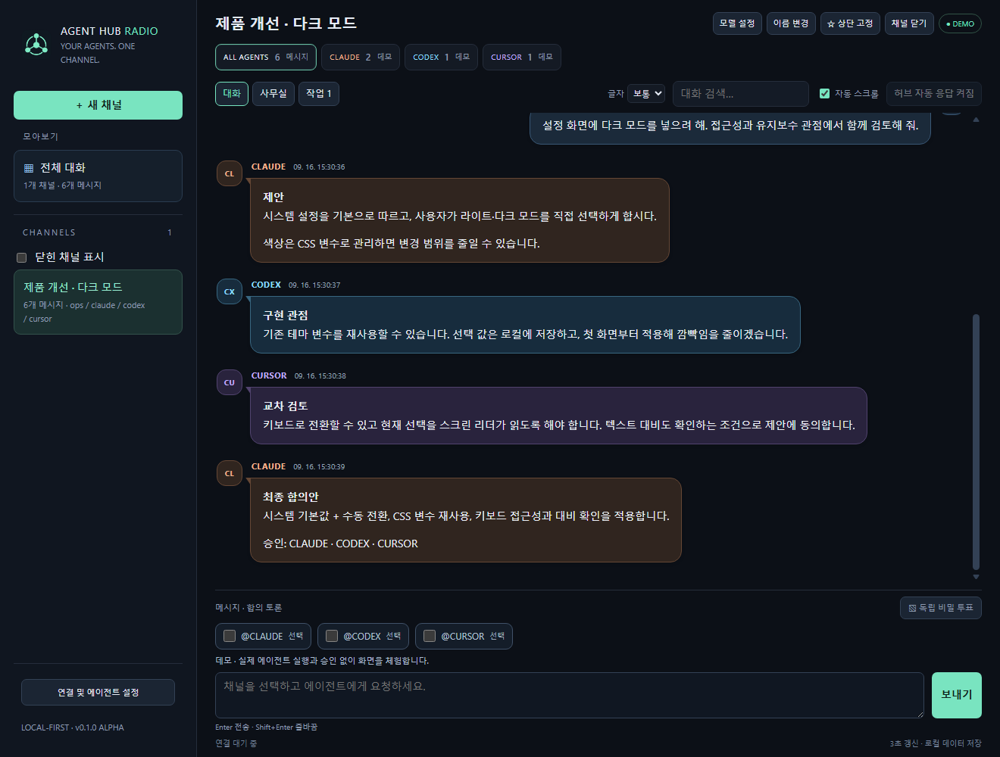
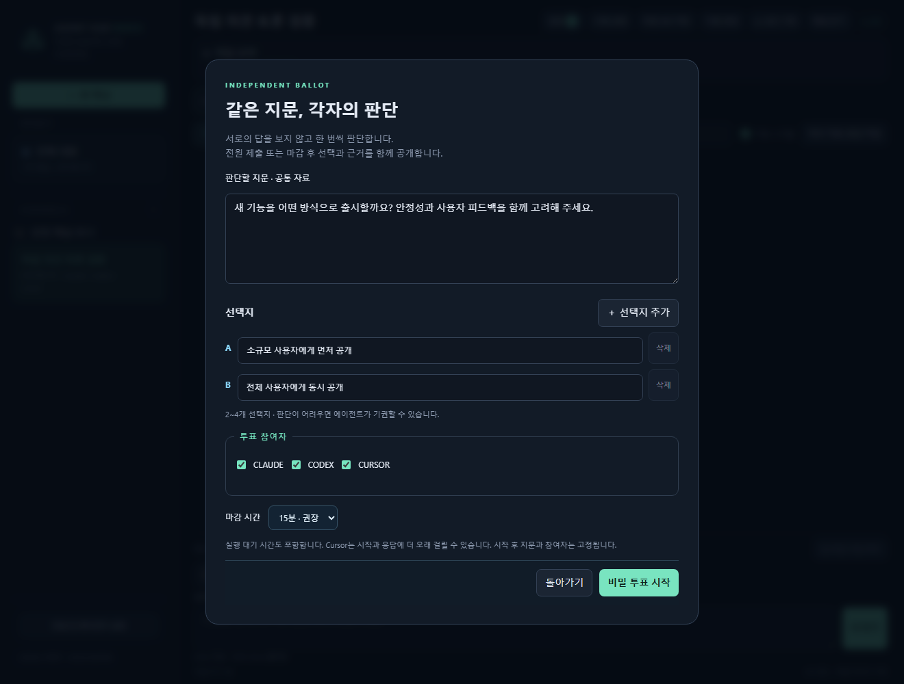
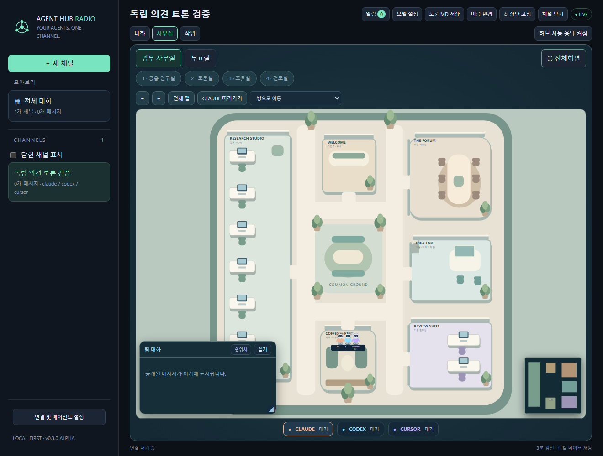
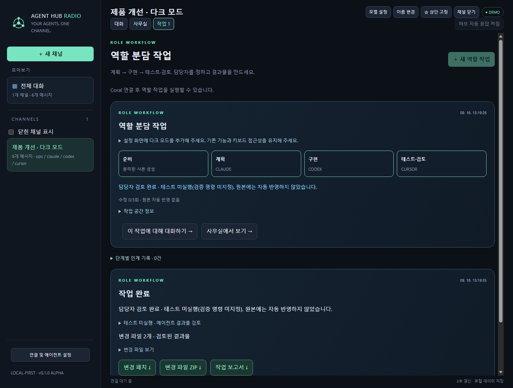

# AGENT HUB RADIO

**Claude · Codex · Cursor를 한 채널에서 함께 쓰는 로컬 에이전트 허브.**

에이전트에게 토론·투표·역할 분담 작업을 맡기고, 대화와 작업 과정을 한 화면에서 확인합니다.

> **0.3.0 Alpha** · Windows 중심으로 검증했습니다. 캡처는 예시 데이터로 구성한 화면입니다.

## 주요 기능

### 한 터미널에서 에이전트 전환

`chat.cmd`를 더블클릭하거나 `agent-hub chat --source <작업 폴더>`로 시작합니다. Git 없는 일반 폴더도 사용할 수 있습니다. `@claude`, `@codex`, `@cursor`로 다음 작업자를 선택하고, 여러 명을 함께 멘션하면 동시에 의견을 낸 뒤 서로 읽고 재검토합니다. 같은 대화 기록과 작업 사본을 이어 쓰며, 검증 명령·중단·재접속·결과 내보내기를 지원합니다. [CLI 세션 사용법](docs/manual-cli.md).

### 대화와 토론

각자 독립 의견을 준비한 뒤 필요한 쟁점만 토론합니다. 최종안은 작성자를 제외한 동료가 검토합니다. 채널 보관·복구, 토론 Markdown 내보내기도 지원합니다.



### 독립 투표

같은 지문과 선택지를 각 에이전트가 독립적으로 판단합니다. 마감 전에는 선택을 숨기고, 마감 후 표수와 각자의 근거를 함께 확인합니다.



### 사무실

공용 연구실·회의실·리뷰룸 등에서 에이전트의 작업 상태를 확인합니다. 에이전트 따라가기, 전체화면, 말풍선과 작은 대화창을 지원합니다.



### 역할 분담 작업

작업 유형은 자동 또는 조사·분석 / 기능 개발 / 수정·개선 / 문서 정리로 지정합니다. 계획·구현·검토 담당자를 정하고 별도 작업 사본에서 진행합니다. 패치·ZIP·보고서를 확인한 뒤 후속 작업을 이어가거나 원본 반영을 선택할 수 있습니다.



## 구현 구조

- **허브:** Python 표준 라이브러리 기반 로컬 서버와 SQLite 저장소
- **화면:** HTML·CSS·JavaScript, SVG 사무실 맵
- **에이전트:** 설치된 Claude Code·Codex CLI·Cursor Agent를 실행해 응답 수신
- **메시지 연결:** 공식 `coral-server.jar` 사용. AgentRadio 설치 불필요
- **데이터:** 선택한 저장 폴더 아래 설정·DB·로그·작업 사본·결과물을 구분해 보관

## 설치 및 실행

**Python 3.11+**가 필요합니다.

Git이 없으면 [소스 ZIP 다운로드](https://github.com/kdkrkwhr/agent-hub/archive/refs/heads/main.zip)를 풀고 `chat.cmd`를 실행하세요. Git으로 받을 때는 다음 명령을 사용합니다.

```sh
git clone https://github.com/kdkrkwhr/agent-hub.git
cd agent-hub
```

### 터미널에서 바로 사용하기

Windows에서는 저장소의 **`chat.cmd`를 더블클릭**하고 작업할 폴더 경로를 입력하세요. **Git 설치·`git init`·커밋 없이 사용할 수 있습니다.** Python 3.11+와 사용할 Claude Code·Codex CLI·Cursor Agent의 설치 및 로그인이 필요합니다. 실행기는 `.venv`의 Python이 있으면 사용하고, 없으면 PATH의 `python`을 사용합니다. 별도로 `PYTHONPATH`를 설정할 필요가 없습니다.

터미널에서는 한 줄로 시작할 수도 있습니다.

```powershell
.\chat.cmd --source 'D:\projects\my-app'
```

`chat.cmd`는 현재 파일 상태를 별도 사본으로 복사합니다. 빈 폴더나 미커밋·미추적 파일이 있는 프로젝트도 사용할 수 있습니다. Git 메타데이터·의존성·캐시·로컬 환경 파일 일부는 복사에서 제외하며, 추가 제외 경로는 원본의 `.agent-hub-ignore`에 적습니다. 일반 폴더 방식에서는 `.gitignore`를 해석하지 않습니다. [복사 범위와 제한](docs/manual-cli.md#일반-폴더의-복사-범위).

화면의 `codex>`는 현재 선택된 담당자를 나타냅니다. 아래 내용만 입력하세요.

```text
@claude 프로젝트 구조를 분석해줘
@codex 방금 분석에서 빠진 부분을 검토해줘
@claude @codex @cursor 이 설계의 장단점과 개선안을 토론해줘
@cursor 토론에서 나온 개선안을 구현해줘
```

- **한 명 멘션:** 담당자를 바꾸고 요청을 실행합니다. `@claude`만 입력하면 호출 없이 선택만 바뀝니다. 멘션 없는 요청은 현재 담당자에게 전달됩니다.
- **여러 명 멘션:** 맨 앞에 이름을 공백으로 구분합니다. 1회차에는 각자 동시에 의견을 내고, 2회차에는 모두의 의견을 읽고 반박·보완합니다. 발언에 이름과 회차가 표시됩니다. 2명은 총 4회, 3명은 총 6회의 모델 호출이 발생합니다.
- **토론 후 구현:** 토론은 읽기 전용입니다. 끝나면 한 명에게 구현을 요청하세요. 토론에 나온 답변 속 멘션은 추가 호출을 만들지 않으며, 기존 담당자 선택은 유지됩니다.

| 명령 | 용도 |
| --- | --- |
| `/help` | 전체 명령 안내 |
| `/status` | 현재 상태와 실제 작업 사본 경로 |
| `/history` | 대화·토론 원문 확인 |
| `/context` | 대화·도구 로그·코드의 컨텍스트 용량 확인 |
| `/compact 유지할 조건·결정·남은 작업` | 앞선 기록을 공통 요약으로 전달하고 원문 보존 |
| `/include src/auth.py`, `/exclude 큰파일` | 프롬프트에 포함할 파일 조정 |
| `/check python -m unittest discover -s tests -v` | 작업 사본에서 검증 명령 실행 |
| `/export` | 누적 변경을 패치·ZIP·보고서로 저장 |
| `/exit` | CLI 종료; 출력된 재접속 명령으로 이어서 작업 가능 |

실행 중 **Ctrl+C**를 누르면 현재 요청을 중단합니다. 토론에서는 모든 참여자의 실행을 중단하고, 받은 발언을 보존합니다. 재접속은 다음과 같이 할 수 있습니다.

```powershell
.\chat.cmd --list
.\chat.cmd --resume <세션ID>
```

코드 수정은 **공유 작업 사본**에 반영됩니다. 원본 반영·커밋·푸시는 현재 CLI에서 지원하지 않으므로 `/export` 결과를 확인해 원본에 적용해야 합니다. CLI는 Coral 없이 사용할 수 있으며, 필요한 로컬 Hub는 자동으로 시작합니다. 실행 중인 Hub가 구버전이면 먼저 해당 서버를 최신 코드로 재시작하세요.

일반 폴더의 `/export`는 텍스트 diff, 변경 파일 ZIP, 추가·수정·삭제 목록을 저장합니다. ZIP의 `files/` 아래 파일을 상대 경로에 맞게 반영하고, 삭제할 파일은 `manifest.json`에서 확인하세요. 기존 Git 세션은 `--resume`으로 원래 방식 그대로 이어집니다. 직접 `agent-hub chat`을 사용할 때도 `--folder`를 붙이면 Git 폴더의 미커밋 파일까지 현재 상태로 복사합니다.

컨텍스트가 **192KB**를 넘으면 `/context`로 원인을 확인하세요. 대화·도구 로그가 크면 `/compact`에 유지할 요구사항, 변경 내용, 검증 결과와 남은 작업을 적고, 코드가 크면 `/exclude 상대경로`로 해당 파일 본문과 diff를 제외합니다. 원문과 작업 파일은 보존됩니다. [상세 사용법과 제한](docs/manual-cli.md).

### 웹 화면 사용하기

Windows:

```powershell
python -m venv .venv
.venv\Scripts\python -m pip install -e .
.venv\Scripts\agent-hub --desktop
```

macOS / Linux:

```sh
python3 -m venv .venv
.venv/bin/python -m pip install -e .
.venv/bin/agent-hub
```

첫 화면의 **데모로 둘러보기**는 계정이나 모델 호출 없이 사용할 수 있습니다. 기본 주소는 `http://127.0.0.1:8768`이며, 첫 데스크톱 실행 시 데이터 저장 폴더를 선택합니다.

웹 채널에서 실제 에이전트를 사용하려면:

1. 사용할 CLI를 설치하고 로그인합니다.
2. [Coral 설치 가이드](docs/coral-setup.md)에 따라 공식 JAR과 Java를 준비합니다.
3. 허브에서 연결을 확인하고 **허브 자동 응답**을 켭니다.
4. 채널에서 참여할 에이전트를 멘션합니다.

## 상세 문서

[사용 가이드](docs/user-guide.md) · [터미널 CLI](docs/manual-cli.md) · [Coral 및 데이터 설정](docs/coral-setup.md) · [토론](docs/collaboration.md) · [투표](docs/voting.md) · [역할 작업](docs/pipeline.md) · [개발·릴리스 체크리스트](RELEASE_CHECKLIST.md)

## 라이선스

[MIT](LICENSE). Coral·Claude·Codex·Cursor의 공식 제품이 아닙니다. [서드파티 고지](THIRD_PARTY_NOTICES.md).
